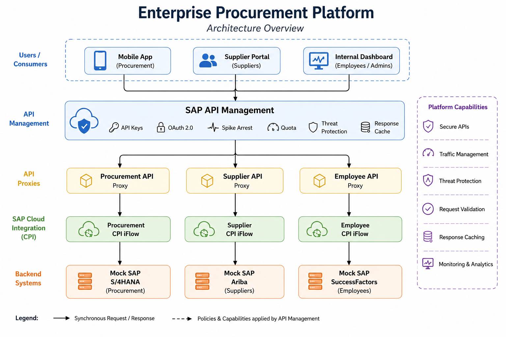
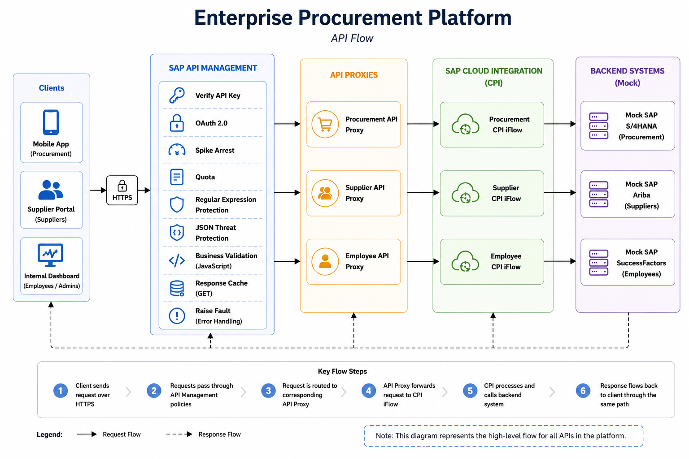
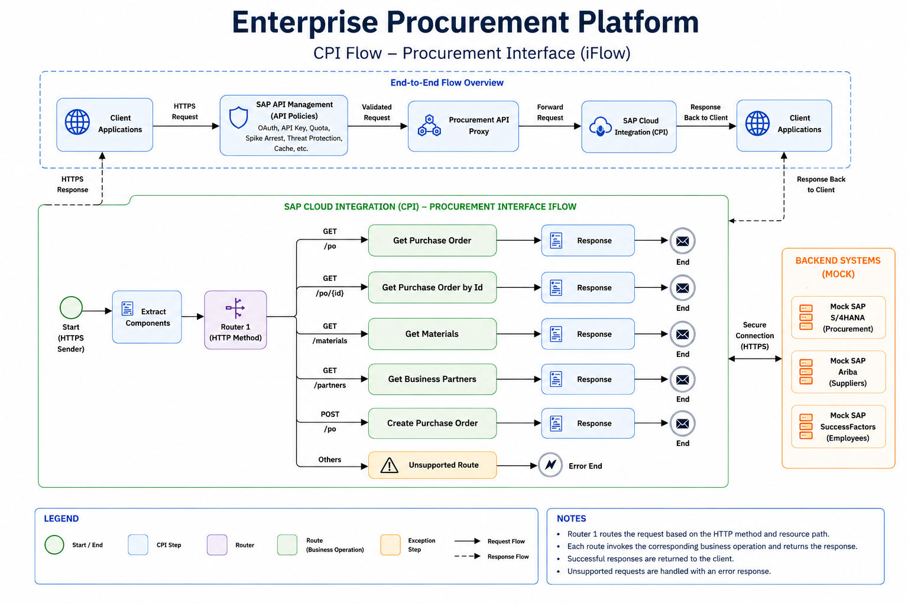

# Enterprise Procurement Platform

> An enterprise procurement platform built using **SAP Integration Suite** (Cloud Integration & API Management) that demonstrates secure API exposure, backend integration, policy-driven API governance, and enterprise integration best practices.

---

## Overview

The **Enterprise Procurement Platform** simulates how modern enterprises securely expose procurement, supplier, and employee services through a centralized API layer.

Instead of allowing client applications to directly access backend enterprise systems, all requests are routed through **SAP API Management**, where authentication, traffic management, caching, and threat protection policies are enforced before forwarding requests to **SAP Cloud Integration (CPI)**.

The backend services are currently implemented as mock integrations and can later be replaced with actual SAP systems such as **SAP S/4HANA**, **SAP Ariba**, and **SAP SuccessFactors** without modifying the API layer.

---

# Business Scenario

ABC Corporation is modernizing its procurement integration landscape.

Multiple applications require secure access to enterprise services:

- Mobile Applications
- Supplier Portal
- Internal Dashboard

Rather than exposing backend systems directly, all requests pass through SAP API Management, which provides:

- Authentication
- API Security
- Traffic Management
- Threat Protection
- Response Caching
- API Lifecycle Management

SAP Cloud Integration performs backend routing and orchestration.

---

# Solution Architecture



---

# API Request Flow



---

# Cloud Integration Flow



---

# Technology Stack

| Layer | Technologies |
|--------|--------------|
| API Management | SAP API Management |
| Integration | SAP Cloud Integration (CPI) |
| Authentication | API Keys, OAuth 2.0 |
| Security | JSON Threat Protection, Regular Expression Protection |
| Traffic Management | Spike Arrest, Quota |
| Optimization | Response Cache |
| Development | Groovy, Content Modifier, Router |
| Testing | Postman, SAP API Debug Trace |

---

# API Endpoints

**Base Path**

```
/api
```

## Procurement API

| Method | Endpoint |
|--------|----------|
| GET | `/procurement/purchase-orders` |
| GET | `/procurement/purchase-orders/{id}` |
| GET | `/procurement/materials` |
| GET | `/procurement/business-partners` |
| POST | `/procurement/purchase-orders` |

## Supplier API

| Method | Endpoint |
|--------|----------|
| GET | `/suppliers/suppliers` |
| GET | `/suppliers/suppliers/{id}` |
| GET | `/suppliers/contracts` |
| POST | `/suppliers/suppliers` |

## Employee API

| Method | Endpoint |
|--------|----------|
| GET | `/employees/employees` |
| GET | `/employees/employees/{id}` |
| GET | `/employees/departments` |

---

# Implemented Features

### SAP Cloud Integration

- HTTP Sender Endpoints
- Dynamic Request Routing
- Groovy-based Request Processing
- Content Modifier
- Mock Backend Responses

### SAP API Management

- API Proxies
- API Products
- Developer Applications
- API Key Authentication
- OAuth 2.0 Client Credentials
- Spike Arrest
- Quota
- Response Cache
- Regular Expression Protection
- JSON Threat Protection
- Raise Fault
- Debug Trace Validation

---

# Repository Structure

```text
enterprise-procurement-platform/

├── README.md
├── LICENSE
├── CHANGELOG.md
├── .gitignore
│
├── docs/
│   ├── diagrams/
│   ├── screenshots/
│   ├── Deployment.md
│   ├── Security.md
│   ├── Testing.md
│   └── Versioning.md
│
├── CPI/
│   ├── Procurement_API/
│   ├── Supplier_API/
│   └── Employee_API/
│
├── API_Management/
│   ├── Proxies/
│   ├── Policies/
│   ├── Products/
│   ├── Applications/
│   └── OAuth/
│
└── Postman/
```

---

# Documentation

Detailed project documentation is available in the following files:

| Document | Description |
|----------|-------------|
| Security.md | Security architecture and authentication |
| Deployment.md | Deployment instructions |
| Testing.md | Functional and policy validation |
| Versioning.md | API versioning strategy |

---

# Current Status

**Current Release:** `v1.0`


# License

This project is licensed under the MIT License.

See the **LICENSE** file for details.

---

